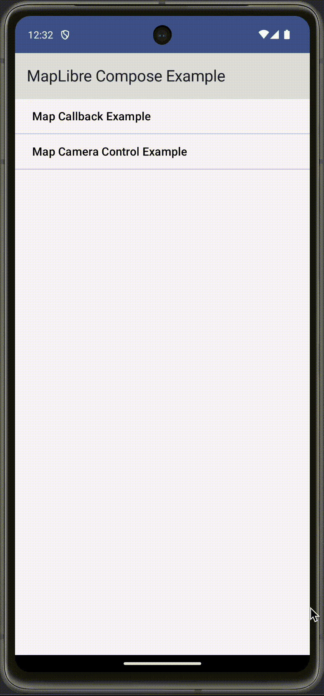

# MapLibre Compose Playground

This project is based off of <https://github.com/ramani-maps/ramani-maps> [MPL-2.0 License] and takes a different approach to top level API, emphasizing parity with <[https://github.com/stadiamaps/maplibre-swiftui-dsl-playground](https://github.com/maplibre/swiftui-dsl)> for <https://github.com/stadiamaps/ferrostar>.

## Getting Started

This library is published through Maven Central. In your app `build.gradle` add:

```groovy
implementation 'io.github.rallista:maplibre-compose:0.0.16'
```

> Note: GitHub package manager releases are deprecated but will remain available.

## Usage

Interact with Maplibre Native from Jetpack Compose using the `MapView`.

```swift
var mapViewCamera = rememberMapViewCamera()

MapView(
    styleUrl = "https://demotiles.maplibre.org/style.json",
    camera = mapViewCamera
)
```



### Local development in an app

Local development in your Android app projects is a bit tricky,
but here's something that mostly works
without thoroughly confusing yourself with Maven Local repos.
(This is definitely a hack, but it works; suggestions welcome.)

First, do a local release build.

```shell
./gradlew assembleRelease
```

Then, update your `build.gradle` to reference the locally built AAR
(`api` works as well of course, if you had an API dependency):

```groovy
implementation files('/path/to/maplibre-compose-playground/compose/build/outputs/aar/compose-release.aar')
```

You will also need to manually specify any MapLibre dependencies now.
For example:

```groovy
api 'org.maplibre.gl:android-sdk:10.3.1'
api 'org.maplibre.gl:android-plugin-annotation-v9:2.0.2'
```

### Setting an API Key for the Light and Dark Mode Demo

Copy or move `api_keys_template.xml` from the root directory to `app/src/main/res/values/api_keys.xml` and add your own API key. The demo uses https://stadiamaps.com as the map style provider, but can easily be adjusted to review with another provider.

### Example Scenes

* [Callback Example](app/src/main/java/com/maplibre/example/examples/CameraExample.kt) - Shows several event callbacks that can be implemented from the `MapView`.
* [Camera Example](app/src/main/java/com/maplibre/example/examples/CameraExample.kt) - Shows the basics of camera control using the `MapViewCamera`.
* [Dark and Light Mode Example](app/src/main/java/com/maplibre/example/examples/DarkAndLightModeExample.kt) - Shows usage of rememberMapStyleUrl which dynamically changes the map style based on if the system theme is dark mode. The styles are injected using a Compose wrapper in MainActivity.kt (similar to how a MaterialTheme is injected).
* [Symbol Example](app/src/main/java/com/maplibre/example/examples/SymbolExample.kt) - Shows the basics of Composable symbol creation. 
